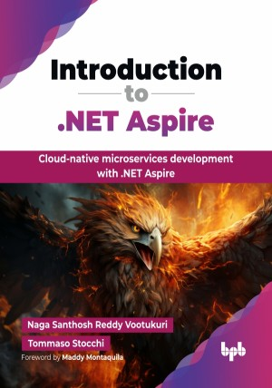

# Introduction to .NET Aspire

Cloud-native microservices development with .NET Aspire.

This is the repository for [Introduction to .NET Aspire](https://bpbonline.com/products/introduction-to-net-aspire?variant=44727157162184), published by BPB Publications. 
The code bundles of this book are available here: https://rebrand.ly/791f62

## About the Book
.NET Aspire is a revolutionary stack created for building cloud-native microservices. It emerges as a game-changer, offering a streamlined, opinionated approach to simplify orchestrating the .NET microservices and connecting them to cloud services with ease.

The book explores the development of .NET Aspire, its core concepts, and a powerful manifest for defining the application's structure and integrations. With this foundation, you will explore practical patterns for seamlessly incorporating polyglot microservices, covering languages like Go, Python, and Node.js. You will gain hands-on experience in OpenTelemetry monitoring, Azure Developer CLI, and Dapr. You will also gain a deep understanding of unit testing practices and AI capabilities, including frameworks like TensorFlow and ML.NET, directly into your .NET Aspire solutions.

By the end of this book, you will possess the practical skills and in-depth knowledge to design, build, deploy, and effectively manage sophisticated, production-ready cloud-native applications, empowering you to excel in the world of distributed systems.

## What You Will Learn
• Understand .NET Aspire fundamental and core architecture principles.

• Build polyglot microservices using C#, Go, Python, and Node.js.

• Deploy application using Azure Developer CLI.

• Integrate Dapr for enhanced distributed application capabilities.

• Build intelligent applications with LLM orchestration and Semantic Kernel.

• Apply best practices for unit testing Aspire components.

• Build resilient, observable, cloud-native .NET solutions.
